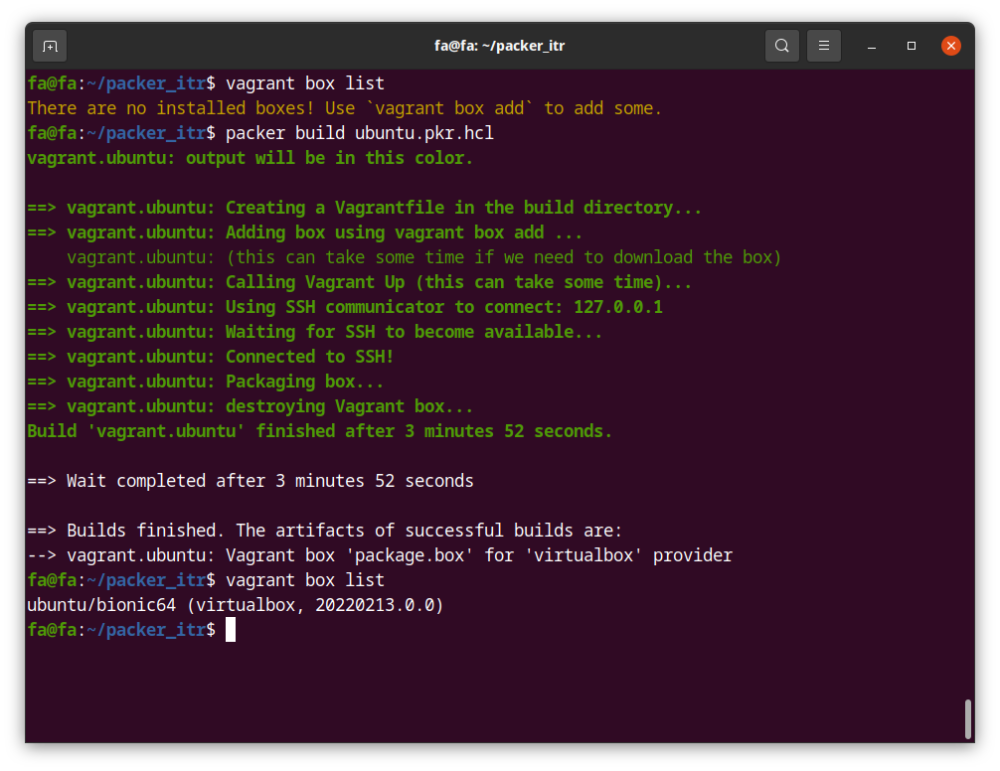
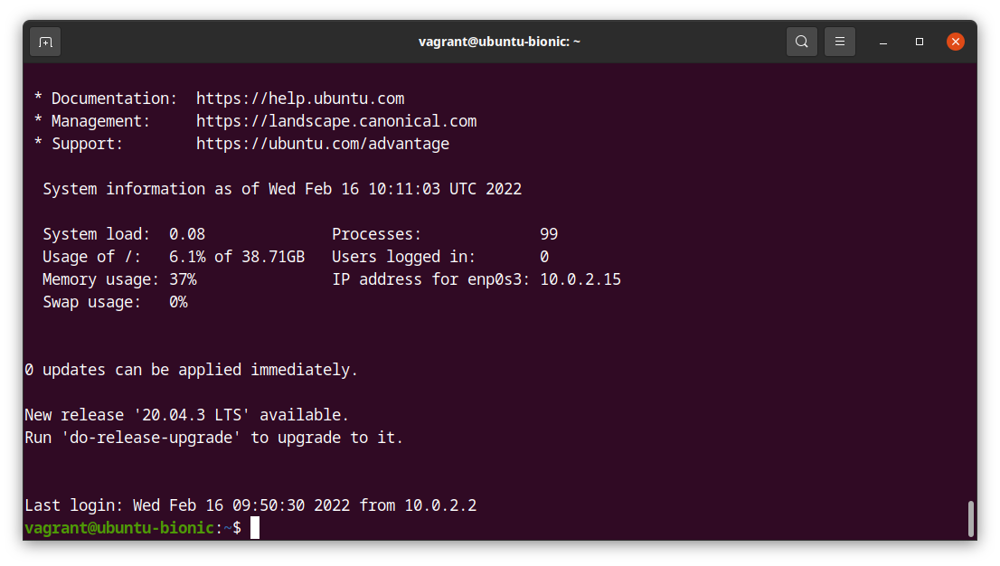
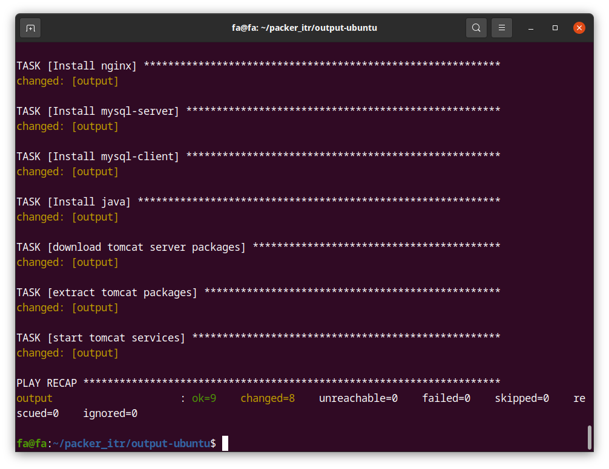
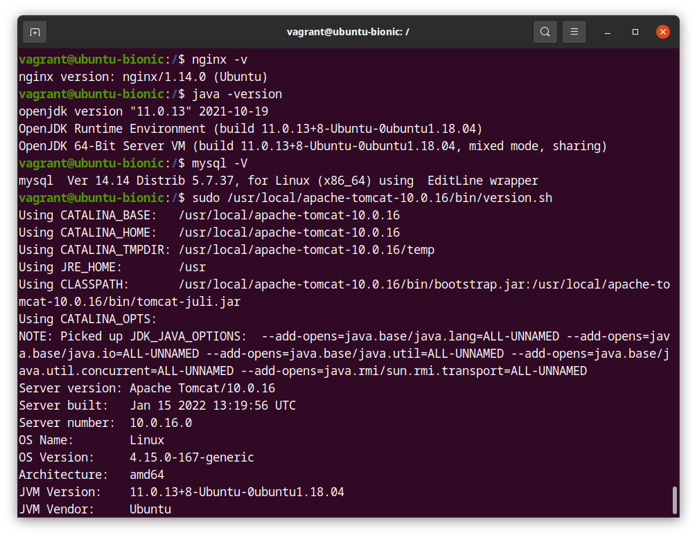
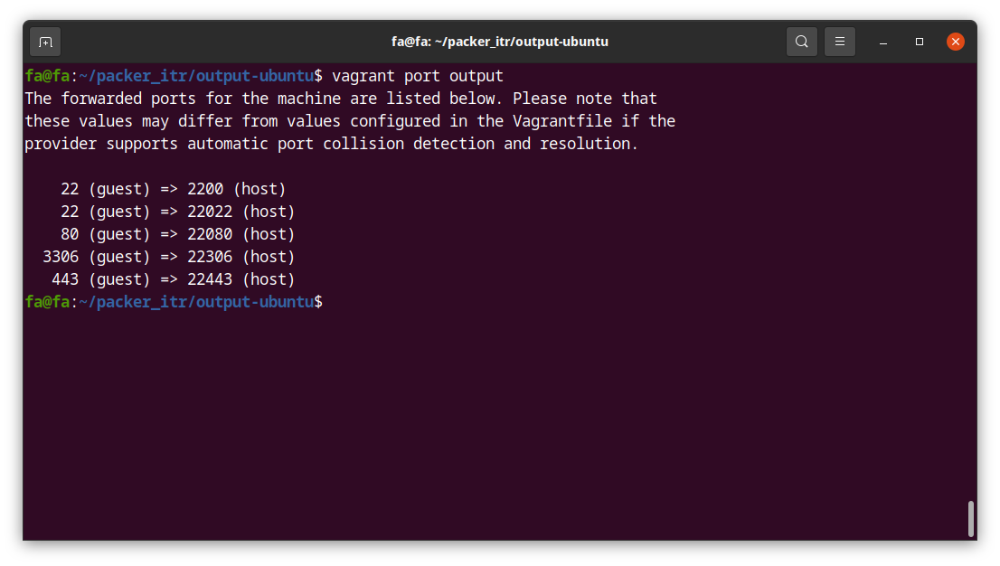
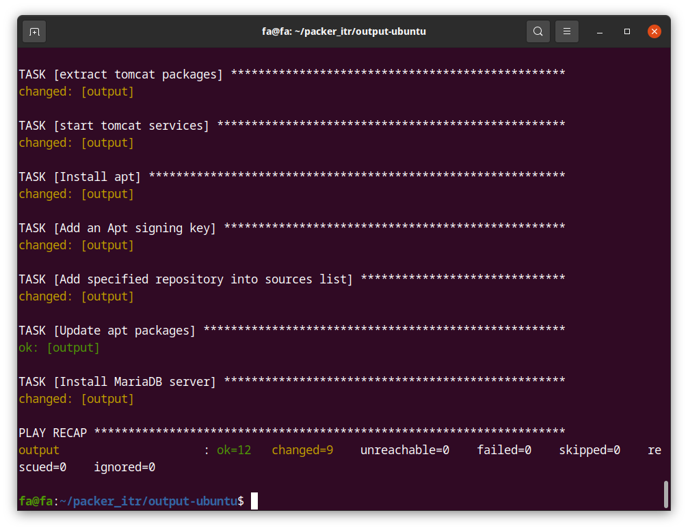
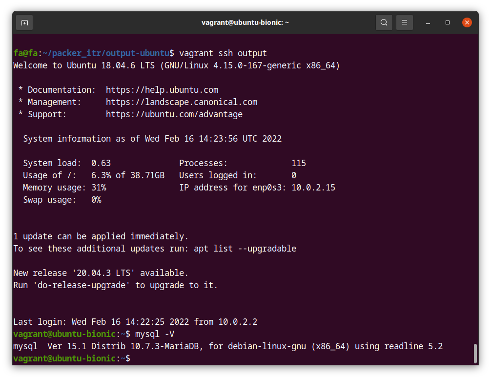

## Vagrant+Packer

Практическое задание:

- [X] 2.1. Создать базовый box с Ubuntu 18.04 с помощью packer, выходной формат - vagrant
      (virtualbox)
      

- [X] 2.2. Запустить свежую виртуальную машину в vagrant
      

- [X] 2.3.  Добавить chef-рецепты для установки на виртуальной машине следующего ПО:
          * Apache/Nginx,
          * Java
          * Tomcat
          * MySQL (client & server) - последних версий
  В качестве альтернативы chef вы можете использовать Ansible или Puppet.
   
   

- [X] 2.4. Пробросить порты следующим образом: хост:22022->гость:22, хост:22080->гость:80,
      хост:22443->гость:443, хост:22306->гость:3306
      

- [X] 2.5. С использованием шаблонов виртуальной машины (для virtualbox) создать новый
      шаблон - с предустановленным mariadb вместо mysql
      
      
