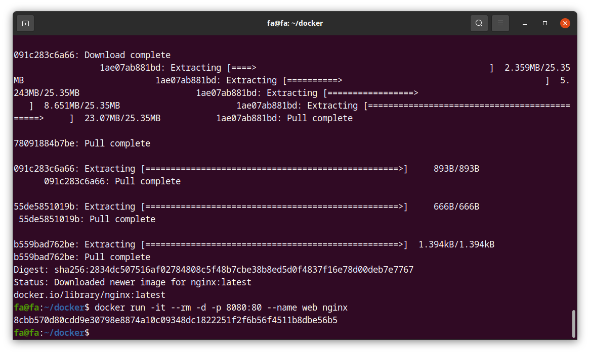
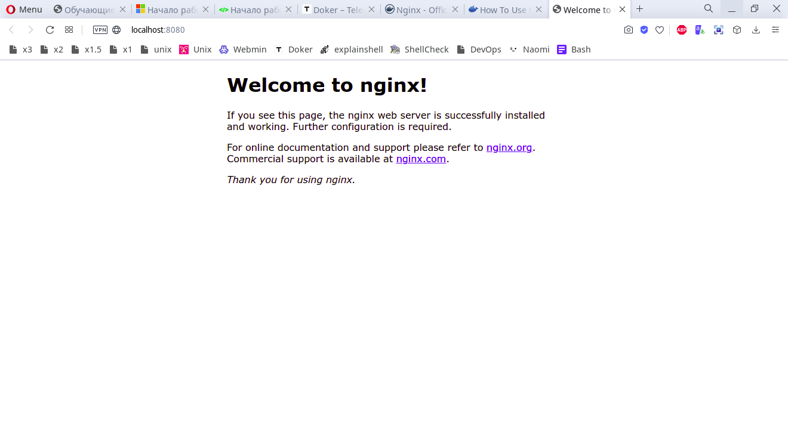
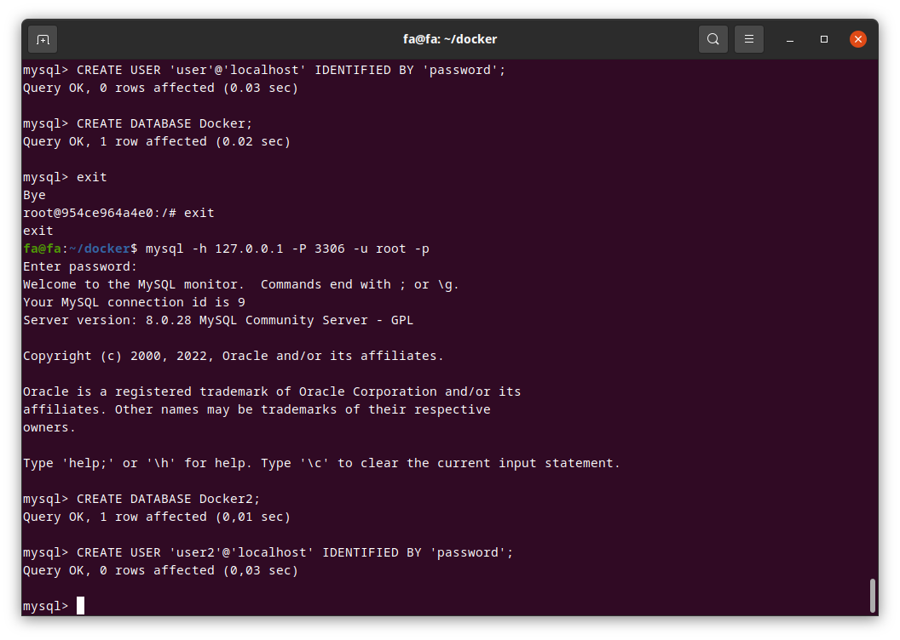
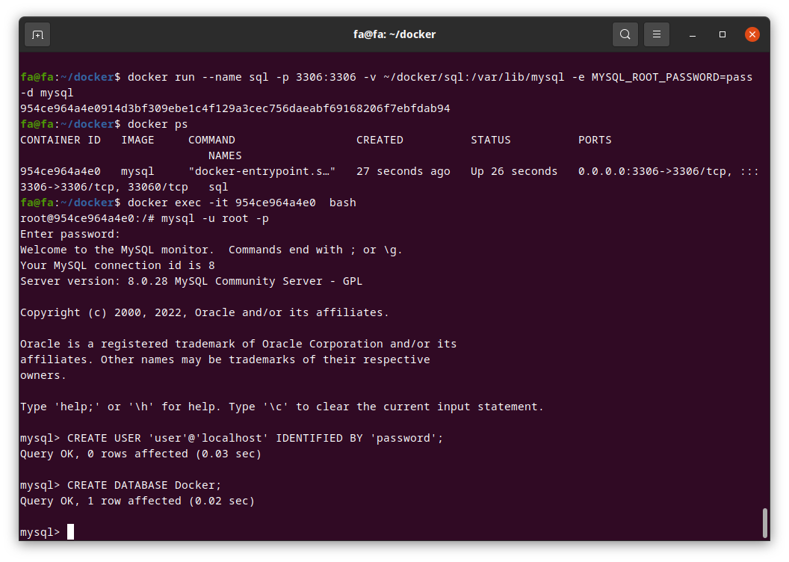
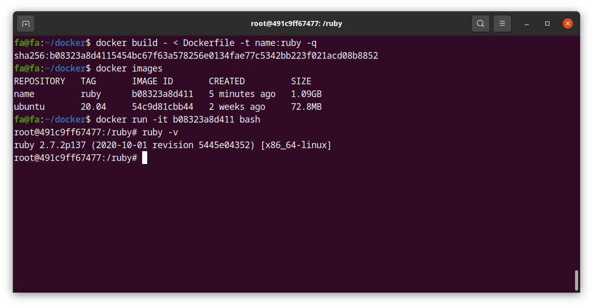

## Docker

Практическое задание:

- [X] 2.6.1. Создайте папку для проекта и перейдите в нее.

- [X] 2.6.2. Установите докер на машину.

- [X] 2.6.3. Запустите контейнер с nginx скачаный из docker hub. Контейнер должен быть
      запущен из командной строки с параметром –expose или -p для того чтобы
      после запуска стартовая страница nginx была доступна из браузера вашего
      компьютера.
      
      

- [X] 2.6.4. Запустите контейнер с MySQL скачаный из докер хаба, используйте --volume
      , -v при запуске контейнера для того чтобы сохранить базу данных жестком
      диске хоста.

- [X] 2.6.5.После запуска контейнера подключитесь к базе, создайте нового
      пользователя и новую базу.
      
      

- [X] 2.7. Работа с Dockerfile

- [X] 2.7.1. Создайте файл Dockerfile в корневой папке проекта.
      В качестве базового образа используйте Ubuntu 20.04

- [X] 2.7.2. Дополните Dockerfile инструкциями из которого при выполнении команды
      docker build соберется docker образ с установленым Ruby 2.7.2

- [X] 2.7.3. После успешной сборки образа, запустите контейнер для выполнения
      команды ruby -v, для проверки работоспособности ruby.
      

- [X] 2.8. Работа с Docker Compose

- [X] 2.8.1. Установите docker-compose на хост

- [X] 2.8.2. С помощью docker-compose установите и запустите сайт на Wordpress.
      По мимо docker-compose.yml файла у вас могут быть другие файлы
      необходимые для работы Wordpress, например nginx.conf и другие.
