# Jenkins
- [X] 1. Установить Jenkins или Teamcity server. Это может быть установка на ваш
        локальный компьютер или на инстансе в облаке, это не имеет значение, как не
        имеет значение и метод уставки (с использованием docker контейнера, playbook
        или установка вручную из репзитория и пр.).
        
- [X] 2. Создать новый проект “Staging”, в нем добавить задачу для сборки простого
        приложения, например
        
        - a. .net: https://github.com/chaitalidey6/HelloWorldAspNetCore/tree/master/HelloWorldAspNetCore
        - b. Java: https://github.com/jenkins-docs/simple-java-maven-app
        - c. Node JS: https://github.com/jenkins-docs/simple-node-js-react-npm-app
               
   Замечания
  
  - Вы можете использовать любое привычное приложение на любом языке
                       (.net, java, js, python, php).
                    
   - Код приложения должен быть размещен в вашем собственном git-репозитории.
     https://github.com/Uliura/jenkins
                         
   - Должна использоваться ветка “staging”.
            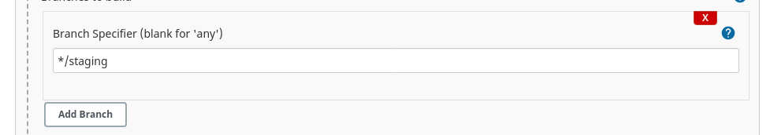
                        
    - Приложение может быть собрано в контейнере (предпочтительный способ).
            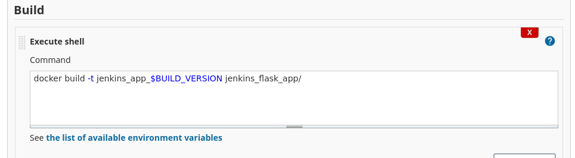
                        
     - Задача по сборке должна запускаться с параметрами.
              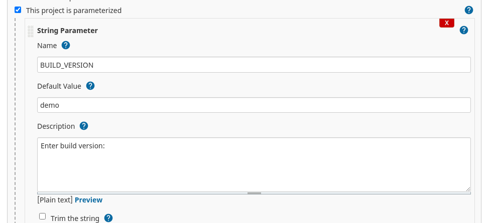
              
  
  - Результатом сборки обязательно должен быть артифакт (архив, docker-контейнер), 
              который вы дальше будете использовать.
              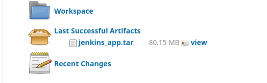
              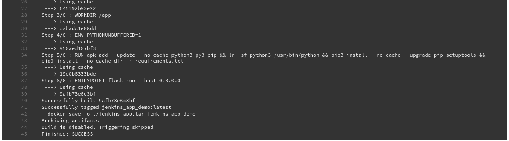
              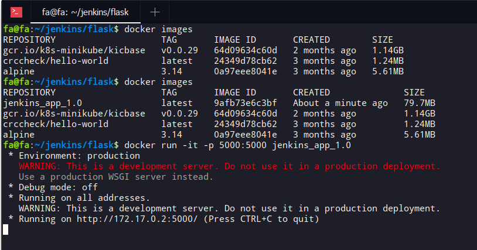
   - Необходимо самостоятельно подумать над тем, каким образом Jenkins/TeamCity получит 
              доступ к git-репозиторию, при этом необходимо придумать наиболее безопасный на ваш вгляд способ.
              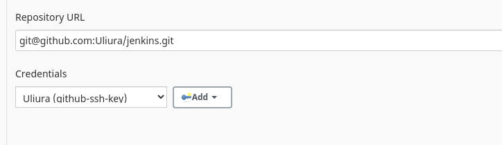

- [X] 3. Создать задачу в Jenkins /Teamcity для деплоя вашего артифакта на сервер и
            перезапуск приложения.
            
Замечания:

        - Здесь артефакт может доставляться на удаленный сервер (например, на
        EC2 инстанс в AWS), либо на контейнер (при работе локально в Docker), либо
        на локальный сервер (при работе с Vagrant/VirtualBox).
        
        - Необходимо самостоятельно подумать над тем, каким образом будет
        организован доступ из Jenkins/Teamcity на сервер (дря загрузки артефактов),
        при этом необходимо придумать наиболее безопасный на ваш вгляд
        способ.
   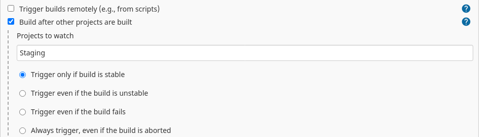
   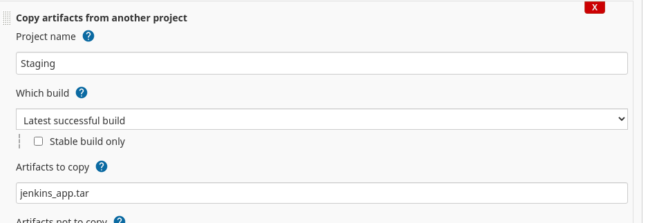
   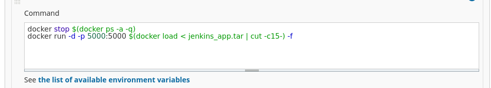
   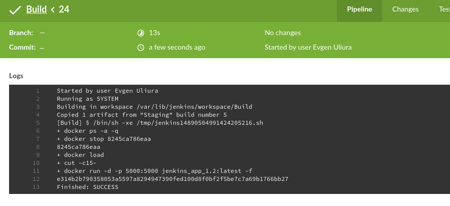

- [] 4. Настроить зависимость задачи деплоя от задачи сборки.
- [] 5. Настроить деплой артифакта в место где он будет работать и запуск приложения.

- [] 6. Добавить задачу создания бэкапа артефактов на сервере.

- [] 7. Настроить пайплайн, где должны быть включены шаги: сборка, бэкап и деплой
(опционально: тестирование).

- [] 8. Настроить автоматический запуск деплоя при добавлении нового commit’а в ветке
“staging” git.

- [] 9. Создать новый проект “Production”, добавить задачу для сборки приложения,
выполнить те же настройки, что и в Staging (п. 2), но с небольшими изменениями:
должна использоваться ветка “master”.

- [] 10. Создать задачу для деплоя Production артефактов на сервер (здесь может
использоваться тот же сервер, но приложения должны быть различными:
«висеть» на разных портах или под разными доменами).

- [] 11. Настроить зависимость задачи деплоя от задачи сборки.

- [] 12. Настроить автоматический запуск деплоя при подтверждении pull request’а в ветке
“master” в git.
