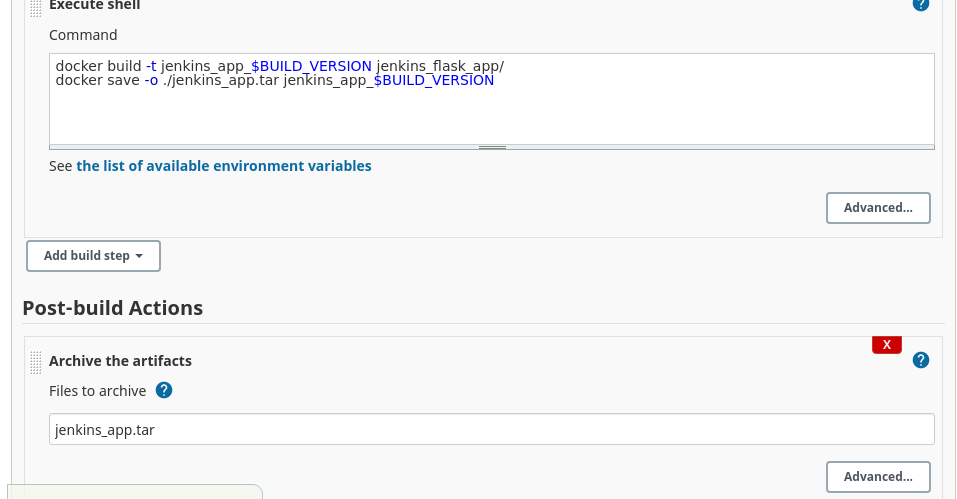
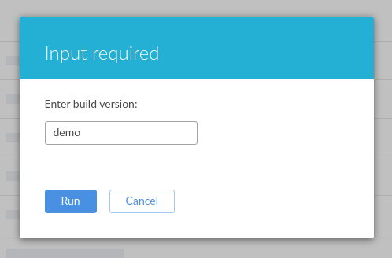

# Jenkins
- [X] 1. Установить Jenkins или Teamcity server. Это может быть установка на ваш
        локальный компьютер или на инстансе в облаке, это не имеет значение, как не
        имеет значение и метод уставки (с использованием docker контейнера, playbook
        или установка вручную из репзитория и пр.).
        
- [X] 2. Создать новый проект “Staging”, в нем добавить задачу для сборки простого
        приложения, например
        
        - a. .net: https://github.com/chaitalidey6/HelloWorldAspNetCore/tree/master/HelloWorldAspNetCore
        - b. Java: https://github.com/jenkins-docs/simple-java-maven-app
        - c. Node JS: https://github.com/jenkins-docs/simple-node-js-react-npm-app
               
   Замечания
  
  - Вы можете использовать любое привычное приложение на любом языке
                       (.net, java, js, python, php).
                    
   - Код приложения должен быть размещен в вашем собственном git-репозитории.
     https://github.com/Uliura/jenkins
                         
   - Должна использоваться ветка “staging”.
            
                        
    - Приложение может быть собрано в контейнере (предпочтительный способ).
            
                        
     - Задача по сборке должна запускаться с параметрами.
              
              
  
  - Результатом сборки обязательно должен быть артифакт (архив, docker-контейнер), 
              который вы дальше будете использовать.
              
              
              
   - Необходимо самостоятельно подумать над тем, каким образом Jenkins/TeamCity получит 
              доступ к git-репозиторию, при этом необходимо придумать наиболее безопасный на ваш вгляд способ.
              
