# Основы AWS

1. Создать выделенную сеть Amazon Virtual Private Cloud с тремя подсетями, как
минимум в двух разных зонах (например, обычно обозначаются как us-west-1a,
us-west-1c). Две подсети (расположенные в разных зонах) должны быть
публичными. Третья подсеть – приватная, ограничить доступ на ACL.
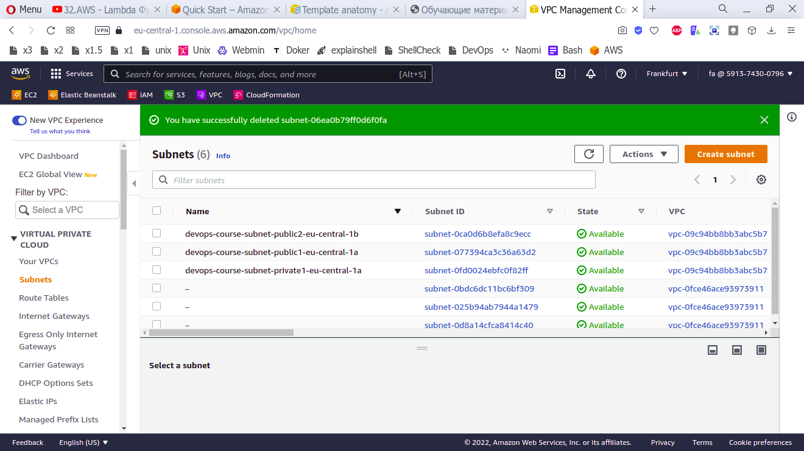
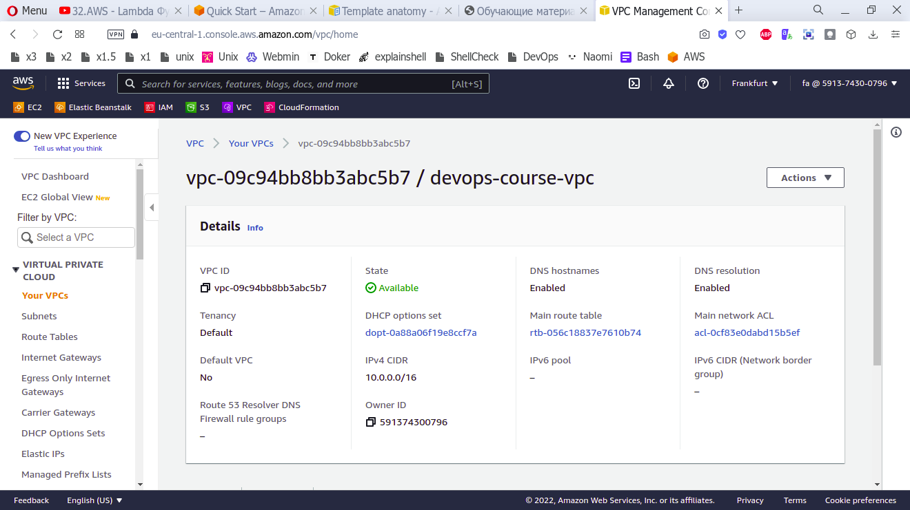
2. Создать Security Group (назовем ее web-sg):
● Разрешить входящий SSH трафик только со своего IP (или доверенных IPs).
● Разрешить входящий HTTP/HTTPS трафик со своего IP (или доверенных IPs).
● Разрешить весь исходящий трафик во все 3 подсети.
● Остальной трафик запретить.
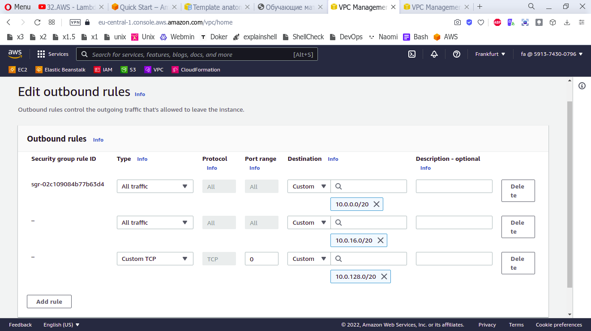
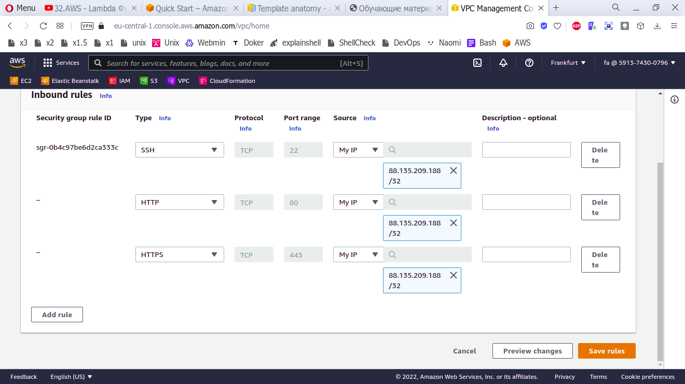
3. Сгенерировать собственный RSA ключ (Key Pairs) для использования в дальнейшем
при создании инстансов (необходимо для подключения по SSH).
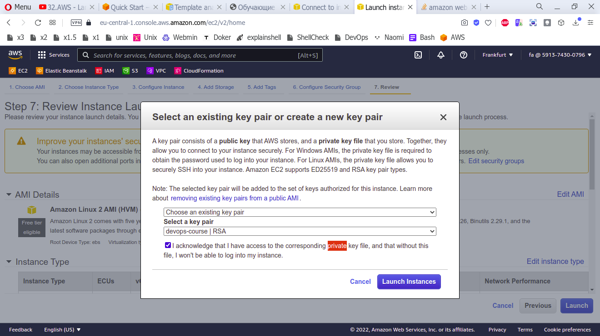
4. EC2:
a. Создать один t2.micro инстанс в созданной в п 6.1 VPC и одной из публичных
подсетей. Использовать Security Group из п 6.1.1.
b. Создать второй t2.micro инстанс в созданной в п 6.1 VPC и второй
публичной подсети. Использовать Security Group из п 6.1.1.
c. На оба инстанса установить Nginx и создать простую страницу-заглушку
(index.html) на 80-ом порту.
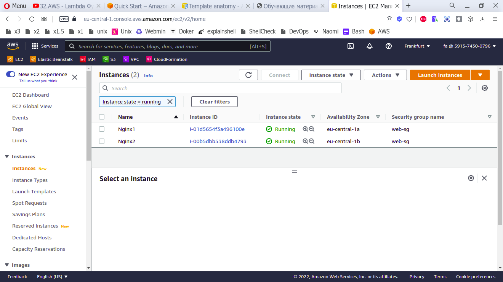
5. ELB:
a. Создать один ELB с поддержкой созданных Availability Zones.
b. Разрешить HTTP трафик на ELB с любого IP адреса.
c. Добавить в ELB оба инстанса.
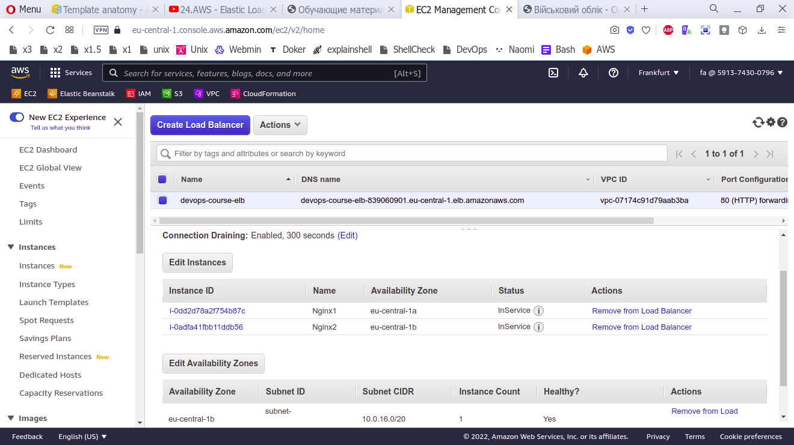
d. Настроить Health Check на протокол HTTP, порт 80, страница index.html с
минимальными интервалами проверки.
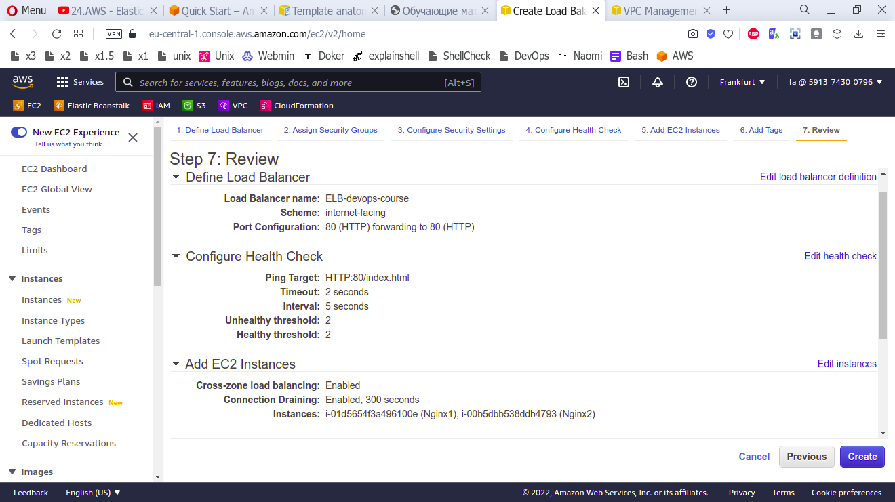
e. Обновить security group созданную в пункте 6.1.1, так чтобы доступ по
http/https был возможен только с ELB.

f. Принудительно остановить веб-сервер на одном из инстансов и проверить
доступность сайта.

6. RDS:
a. Создать инстанс PostgreSQL в выделенной VPС и приватной подсети с типом
хранилища как General Purpose и объёмом в 20 Гб. Использовать Security
Group из п 6.1.2.
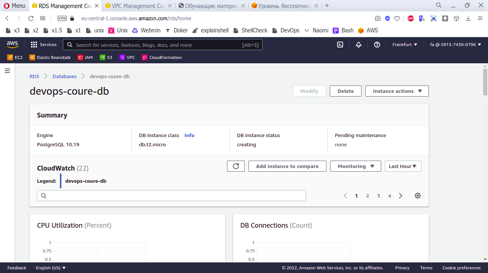
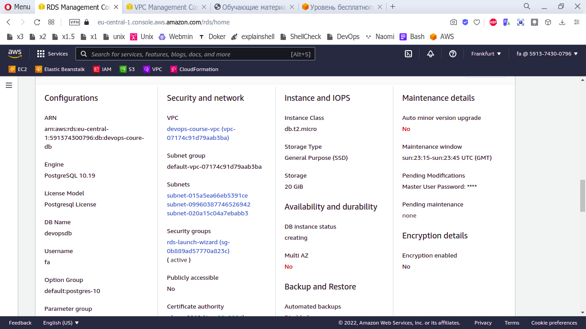
b. Разрешить входящий трафик только от web-sg. Как результат должны
продемонстрировать возможность подключения к RDS как минимум с двух
иcходных точек (серверов)
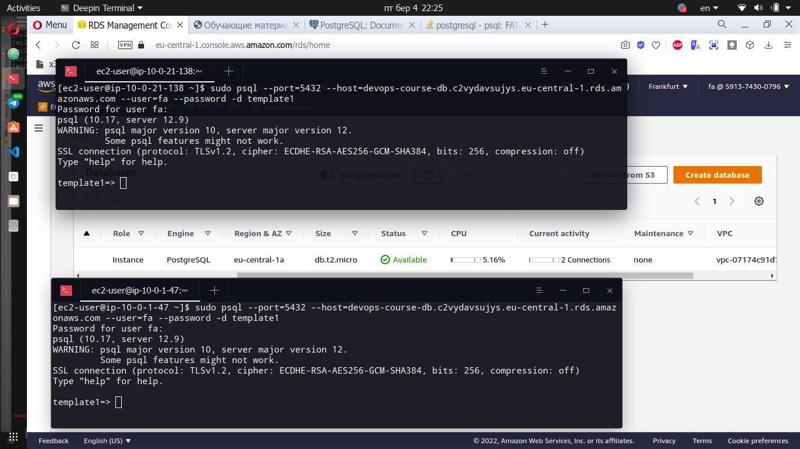
7. ElastiCache:
a. Создать один инстанс ElastiCache (Redis) в выделенной VPC.
b. Разрешить трафик только внутри выделенной VPC. Как результат: должны
продемонстрировать возможность подключения к Redis как минимум с двух
иcходных точек (серверов)
c. Создать один инстанс ElastiCache (Memcached) в выделенной VPC.
d. Разрешить трафик только от серверов созданных в пункте 5.3. Как
результат: должны продемонстрировать возможность подключения к
Memcached как минимум с двух иcходных точек (серверов)
8. Создать CloudFront Distribution с параметрами по умолчанию.
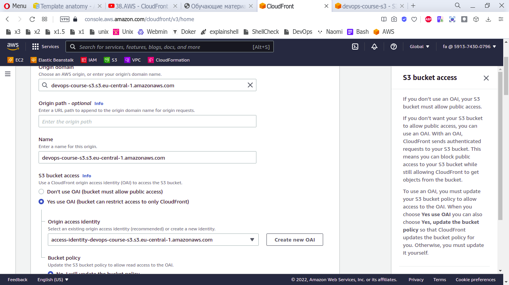
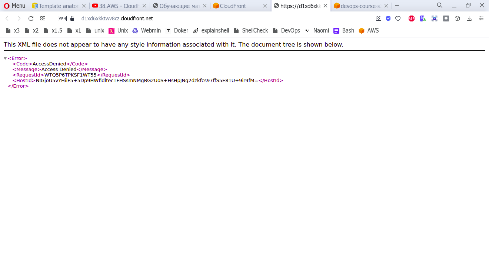
a. Сгенерировать 100 небольших файлов ( < 512 Kb) и заполнить ими
созданный бакет в S3. К файлам сторонние лица не должны иметь доступ.
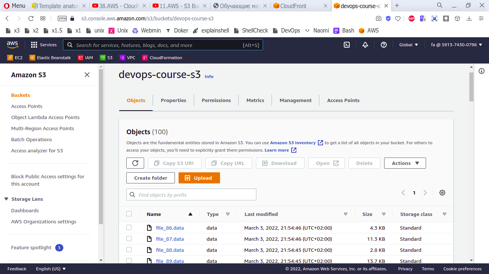
b. Настроить политику хранения объектов в данном бакете S3 следующим
образом:
● по истечении 30 дней – отправлять объекты в Glacier;
● после 6 месяцев хранения – полностью удалять с Glacier.

9. *На одном из серверов созданных в пункте 6.3. подготовьте скрипт (с
использование aws cli) для загрузки/выгрузки/удаления файлов в S3 бакете
созданном в пункте 6.7.1 в соответствии с best practice и наибольшим уровнем
безопасности окружения.
10. *Заменить инстансы (ELB должно будет ссылаться на новые инстансы созданные
через autoscaling group) созданные в пункте 6.3 на autoscalinng group, со
следующими правилами:
● Если CPU Utilization > 70%, то добавить инстанс
● Если CPU Utilization < 15%, то удалить инстанс
● Минимальное количество запущенных инстансов = 1
● Максимальное количество запущенных инстансов = 4
● Autoscaling group должна разворачивать инстанс вместе с установленным nginx
и страницей заглушкой из пункта 6.3
