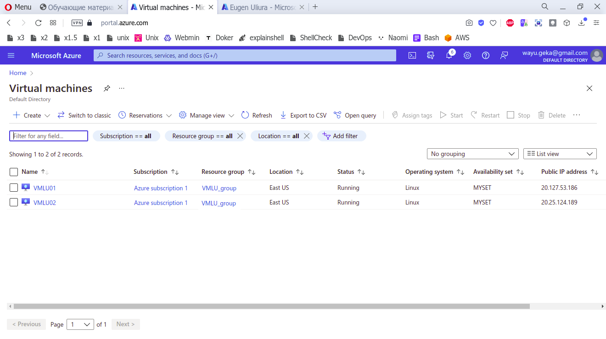
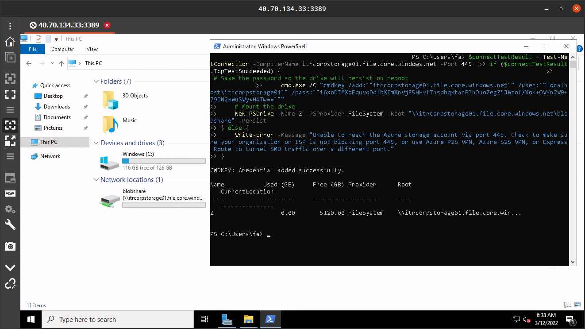
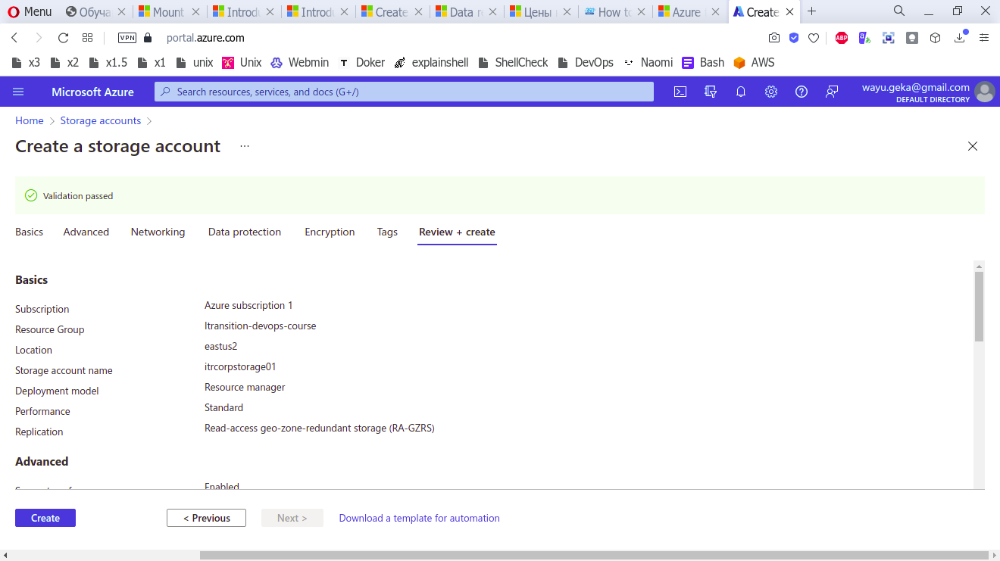
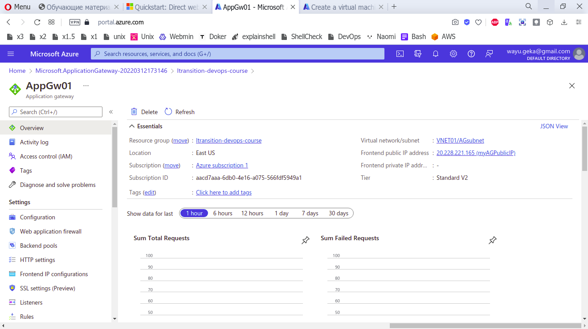
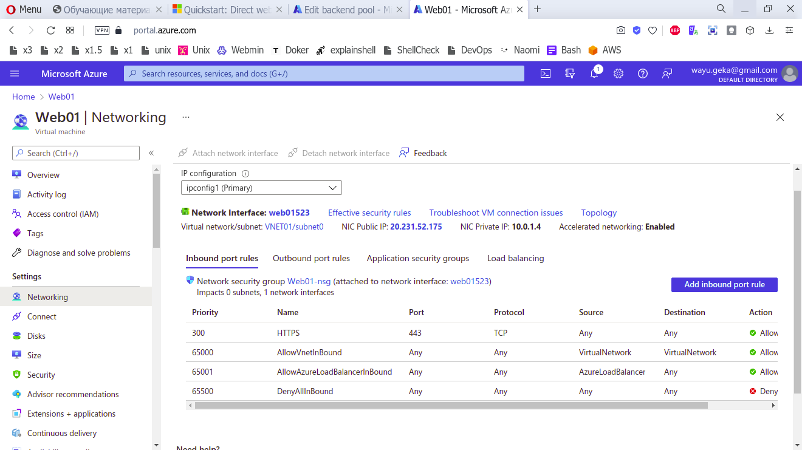
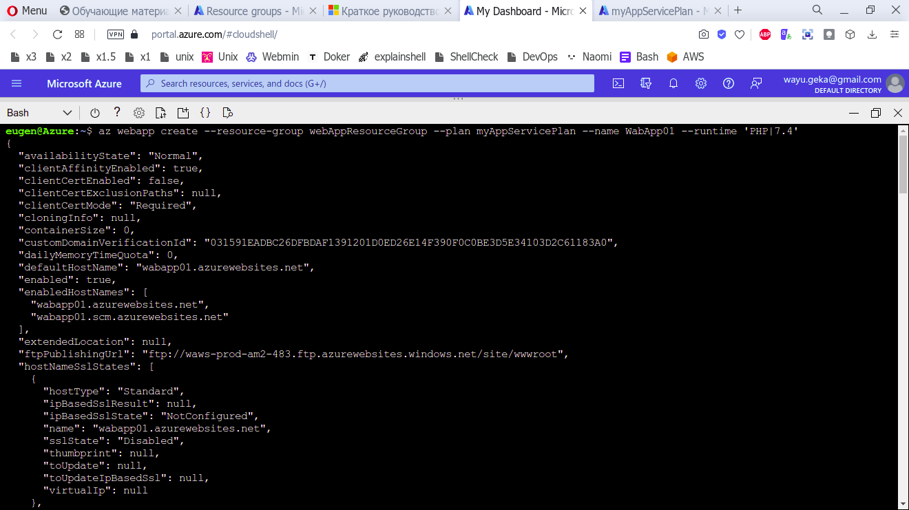
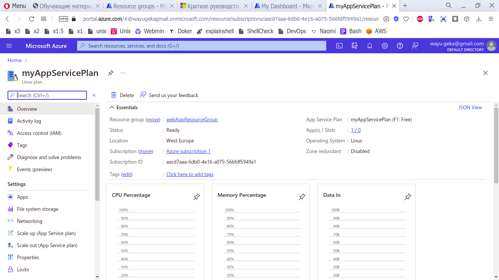
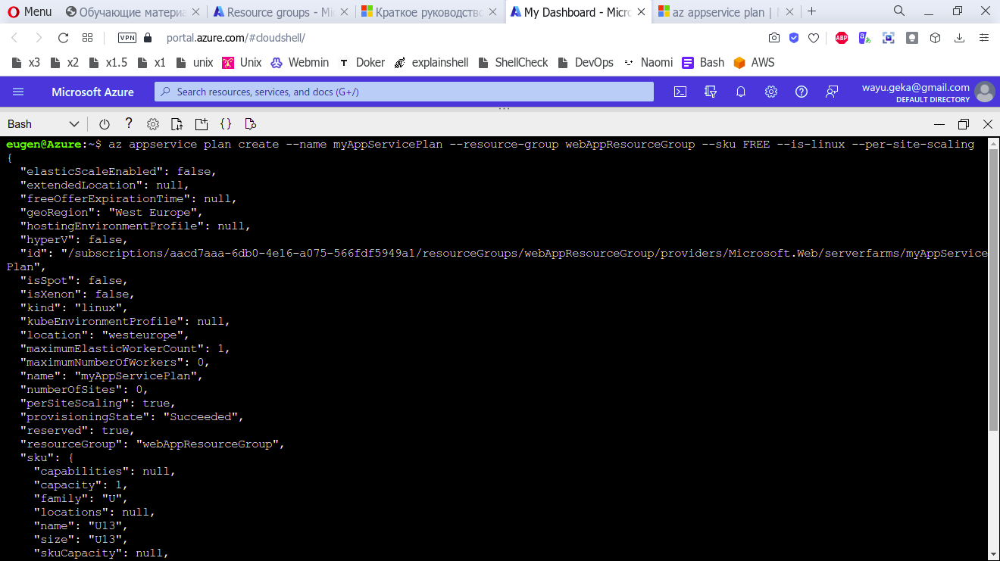
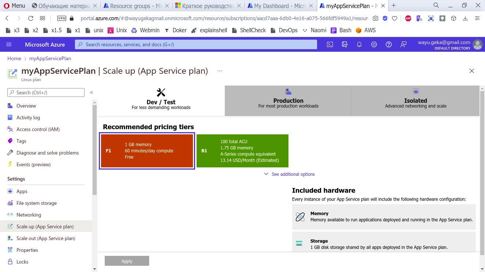

# Azure
- [X] 1. Вам необходимо развернуть две виртуальные машины Azure с именами VMLU01 и
VMLU02 на основе образа Ubuntu. Развертывание должно соответствовать
следующим требованиям: Обеспечение SLA 99,95%.Использование managed disks.

99.95% достигается путем добавления VM в Aviliability Set. managed disks используется
по умолчанию..

- [X] 2. Вы планируете забэкапить файлы и документы с on-premise Windows file server в
хранилище Azure. Бэкап файлы будут храниться в виде блобов.
Вам необходимо создать storage account с именем CorpStorage01. Решение должно
соответствовать следующим требованиям:
● Убедитесь, что документы доступны через drive mapping c виртуальных
машин Azure под управлением Windows Server.

● Обеспечьте максимально возможное redundancy документов.
● Минимизируйте затраты на storage account.
  Разместил в более дешевом регионе. Другие возможные минимизации - фиксированная
   закупка обьема и сроков использования, а так же частота доступа.

- [X] 3. Вы планируете развернуть Application Gateway с именем AppGw01 для
балансировки нагрузки внутреннего IP-трафика на виртуальные машины Azure,
подключенных к subnet0.

Вам необходимо настроить виртуальную сеть с именем VNET01 для поддержки
Application Gateway.
- [X] 4. Вы планируете разместить несколько защищенных веб-сайтов на Web01. Вам
необходимо разрешить HTTPS через TCP-порт 443 на Web01 и запретить HTTP через
TCP-порт 80 на Web01.

- [X] 5. Вам нужно создать веб-приложение с именем WabApp01, которое можно
горизонтально скалировать. Решение должно использовать самый низкий
возможный ценовой уровень app Service Plan.

