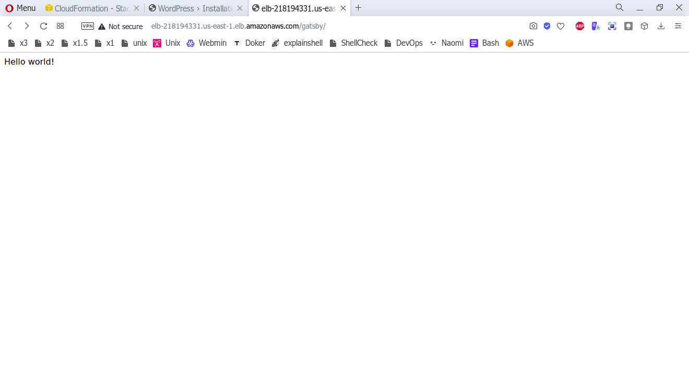

# AWS

Условия:
1. Задачи должны выполняться на Centos или Amazon Linux
2. Необходимо разобраться с установкой Apache + PHP 7.3 + MySQL + NPM, если
получится - автоматизировать этот процесс (достаточно все оформить в bash,
ansible)
3. Зарегистрировать бесплатную учетную запись в AWS
4. Разобраться со стоимостью сервисов в AWS и все дальнейшие действия делать
только на бесплатном окружении!
5. Создать новый Инстанс, автоматически установить на нем софт из п.2, сохранить
как AMI и удалить.
6. Используя Cloudfront:
a. Запустить инстанс, с предустановленным ПО из AMI из п.5.
b. Создать Application load balancer, добавить маршрутизацию на сервер из п.5
c. Входные параметры Cloudformation:
i. Размер инстанса (выпадающий список)
ii. SSH Ключ
iii. Использование публичного IP адреса (true/false)
iv. VPC, где будет размещен инстанс
v. Имя инстанса, которое будет задано как тэг Name.
d. Выходные параметры:
i. Публичный IP инстанса
ii. DNS, полученный в Load Balancer
7. На сервере сделать два сайта (через виртуальную директорию, или через хосты -
на усмотрение)
a. 1й сайт: установить самый Wordpress без дополнительной кофигурации
b. 2й сайт: установить статический сайт
https://github.com/gatsbyjs/gatsby-starter-hello-world
Оба сайта должны работать через балансировщик
В качестве успешно выполненного задания необходимо показать:
a. Скрипт по конфигурированию сервере (установке необходимого софта из
п.2) – bash или playbook
b. Шаблон cloudformation для разворачивания окружения
c. Сайт на WP

d. Сайт на gatsby

